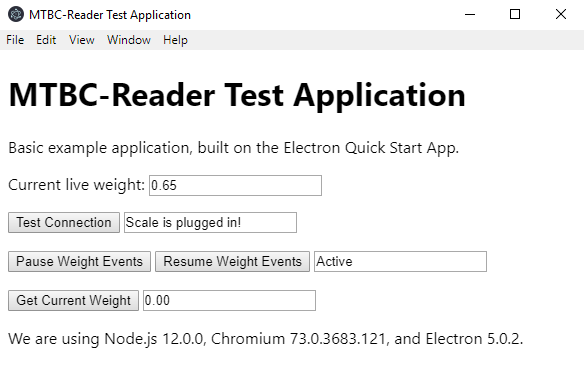

# mtbc-reader - Provides extensive support for interfacing with Mettler Toledo BC scales.

- [mtbc-reader - Provides extensive support for interfacing with Mettler Toledo BC scales.](#mtbc-reader---provides-extensive-support-for-interfacing-with-mettler-toledo-bc-scales)
  - [Installation](#installation)
  - [Examples](#examples)
  - [Usage](#usage)
    - [Reference the scale reader](#reference-the-scale-reader)
    - [Getting the weight from the scale](#getting-the-weight-from-the-scale)
  - [Getting the scale's status](#getting-the-scales-status)
    - [Tell whether or not the scale is plugged in](#tell-whether-or-not-the-scale-is-plugged-in)
    - [Raw status](#raw-status)
  - [Complete API](#complete-api)
    - [`.getWeightLb()`](#getweightlb)
    - [`.getWeightKg()`](#getweightkg)
    - [`.getWeightOz()`](#getweightoz)
    - [`.events`](#events)
    - [`.isPluggedIn()`](#ispluggedin)
    - [`.isFault()`](#isfault)
    - [`.isMoving()`](#ismoving)
    - [`.isUnderZero()`](#isunderzero)
    - [`.isOverweight()`](#isoverweight)
    - [`.getStatus()`](#getstatus)
    - [`.pause()`](#pause)
    - [`.resume()`](#resume)
    - [`.getByte()`](#getbyte)
    
## Installation
```console
npm install mtbc-reader
```
```js
const scale = require("mtbc-reader");
```

## Examples
A basic [example](./src/test-app/) application is provided in the `src/` directory.


## Usage

### Reference the scale reader
```js
const scale = require('mtbc-reader')
```

Manual registration of the scale is never required, the library handles all scale/usb registration, connect, and disconnect events - you only need to reference the library to use it.

### Getting the weight from the scale
There are two methods of obtaining the weight from the scale.

The simplest method is `.getWeightLb()`
```js
var weight = scale.getWeightLb();
console.log("Weight on scale is: "+weight+" pounds.")
```
Additionally, `.getWeightKg()` and `.getWeightOz()` can be used as well.

The second method is via the events system.
```js
scale.events.on("change", function(weight) {
    //weight = scale.getWeightKg(); or manual conversion if you need something other than pounds
    console.log("The weight on the scale has changed! The weight is: "+weight+" pounds.")
});
```
The event is better suited for live visual interfaces or any other situation where you might consider polling the first method.

The event stream can be paused with `scale.pause()` and resumed with `scale.resume()`

- Note: if the scale is unplugged or otherwise unregistered the event will simply stop firing, it will not disconnect or throw any errors - `.isPluggedIn()` can be used to check status if required.
- Note: The event only returns in pounds, you can either call .getWeightKg(), .getWeightOz() in the event callback, or manually convert to another unit.

## Getting the scale's status 
A number of helper functions are included in the library to obtain more information about the scale.

### Tell whether or not the scale is plugged in
`scale.isPluggedIn()` Can be used to determine whether the scale is plugged in or not.
```js
if (scale.isPluggedIn()) {
  console.log("Scale is plugged in!");
} else {
  console.log("Error: Scale is not plugged in!");
}
```

Further helper functions are listed in the full API below.

### Raw status
Additionally, you can just get the raw scale status and process it yourself:

```js
var status = scale.getStatus();

switch(status) {
    ...
}
```
The status format is as follows:
- 1: Fault,
- 2: Stable @ 0,
- 3: In motion,
- 4: Stable,
- 5: Under 0,
- 6: Over-weight,
- 7: Requires calibration,
- 8: Requires re-zeroing

- Note: 0 will be returned by the reader if `getStatus()` is accessed while the scale is unplugged or otherwise unregistered


## Complete API

### `.getWeightLb()`
- Returns the scale weight in pounds, to the hundredth decimal point.
- Note: If the scale is unplugged, any attempts to get the weight will return 0.

### `.getWeightKg()`
- Returns the scale weight in kilograms, to the hundredth decimal point.
- Note: If the scale is unplugged, any attempts to get the weight will return 0.

### `.getWeightOz()`
- Returns the scale weight in ounces, to the hundredth deceimal point.
- Note: If the scale is unplugged, any attempts to get the weight will return 0.

### `.events`
- EventEmitter for weight change, use event "change".

### `.isPluggedIn()`
- Returns true if the scale is plugged in.

### `.isFault()`
- Returns true if the scale is warning that a fault has/is occurring

### `.isMoving()`
- Returns true if the scale is encountering a load greater than it's official max capacity.

### `.isUnderZero()`
- Returns true if the scale is returning a value below zero (either negative numbers or simply refusing to display anything on the LCD)
- Note: If the scale *is* below zero, any attempts to get the weight value will round up to 0.

### `.isOverweight()`
- Returns true if the scale is encountering a load greater than it's official max capacity.

### `.getStatus()`
- Obtain the raw status of the scale in IDs 1-8
Status format is as follows:
```
1: Fault,
2: Stable @ 0,
3: In motion,
4: Stable,
5: Under 0,
6: Over-weight,
7: Requires calibration,
8: Requires re-zeroing
```

### `.pause()`
- Pause sending of the weight change events.

### `.resume()`
- Resume sending of the weight change events.

### `.getByte()`
- Returns the raw data byte from the scale.
Byte format for scale is as follows:
```
Byte 0: Report ID
Byte 1: Scale status 
Byte 2: Weight unit 
Byte 3: Data scaling
Byte 4: Scale Weight LSB
Byte 5: Scale weight MSB
```
